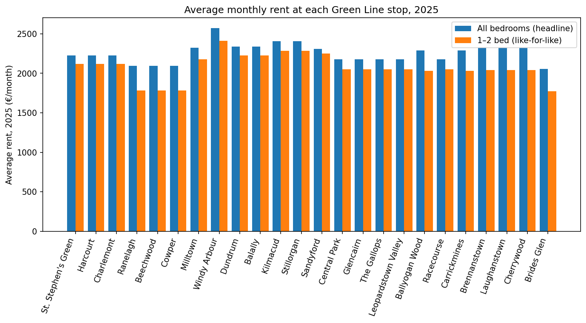
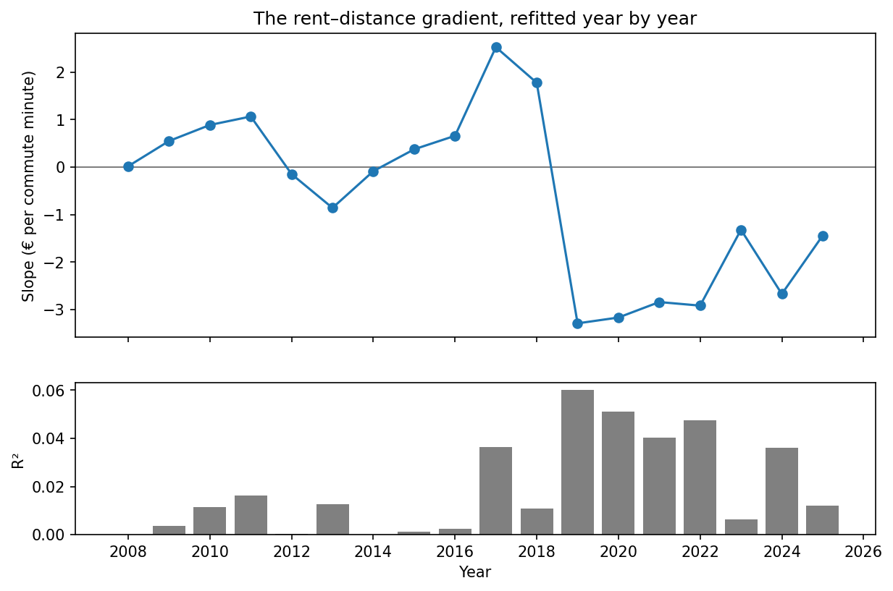

# Luas Green Line Rent Analysis

How much does rent change as you travel south on Dublin's Luas Green Line?

This project combines the Residential Tenancies Board (RTB) Average Monthly Rent Report with official Luas stop locations to compare rents near all 24 stops from St. Stephen's Green to Brides Glen. It tests whether a longer commute actually buys cheaper rent, identifies unusually large price changes between neighbouring stops, and highlights stations that offer the strongest balance between rent and travel time.

**[Open the live Streamlit dashboard](https://luas-green-line-rent-explorer.streamlit.app/)**

The analysis uses annual registered-tenancy rents from 2008 to 2025. For like-for-like comparisons, the main results use the RTB's **1 to 2 bed / all property types** category because it is the only bedroom-size series published across every area represented on the line.

## Key findings

- **Commute time is a very weak predictor of rent.** In 2025, the fitted rent gradient is only **-€1.44 per additional commuting minute**, with an R² of **0.01**. Distance from the city centre explains almost none of the station-to-station variation.
- **Ranelagh provides the strongest short-commute value in the selected measure.** Its 2025 average 1–2 bed rent is €1,784, €335 below the city-centre benchmark, with a seven-minute journey to St. Stephen's Green.
- **The largest neighbouring-stop price increase is Cowper to Milltown:** an increase of €396 per month for the same 1–2 bed category.
- **The simple “farther out means cheaper” assumption does not hold on this corridor.** Local housing markets and area characteristics matter more than the number of stops from the city centre.





## What the project includes

- A reproducible Python data pipeline for RTB and Transport Infrastructure Ireland data
- A SQLite database with a documented schema and 17 business-focused SQL queries
- Exploratory and analytical Jupyter notebooks using SQL, pandas and scikit-learn
- Regression, time-series, price-cliff and value-for-money analysis
- Matplotlib, Plotly and Folium visualisations
- An interactive Streamlit dashboard
- A Power BI-ready export, report theme and beginner build guide

## Data sources

- [RTB Average Monthly Rent Report, CSO table RIA02](https://data.cso.ie/table/RIA02)
- [Transport Infrastructure Ireland Luas stop locations](https://data.tii.ie/Datasets/Luas/StopLocations/)

The RTB data measures rents recorded for registered tenancies; it is not a scrape of current property listings. Each stop is mapped to the closest available RTB reporting area. Several stops therefore share the same rent figure, and the results should be interpreted as an area-level corridor analysis rather than a property-level estimate.

## Project structure

```text
luas-green-line-rent-analysis/
├── app/
│   └── streamlit_app.py
├── data/
│   ├── luas_stations.csv
│   ├── processed/
│   └── raw/                     # downloaded locally; not committed
├── database/
│   ├── queries/                 # 17 analytical SQL queries
│   ├── schema.sql
│   └── rent_data.db             # rebuilt locally; not committed
├── notebooks/
│   ├── 01_data_exploration.ipynb
│   └── 02_analysis.ipynb
├── powerbi/
│   ├── luas_rent_powerbi.csv
│   ├── luas_theme.json
│   └── README_powerbi_guide.md
├── reports/figures/
├── src/
│   ├── analysis.py
│   ├── data_loader.py
│   ├── export_powerbi.py
│   ├── sql_utils.py
│   └── visualize.py
└── requirements.txt
```

## Reproduce the analysis

Python 3.9 or later is recommended.

```bash
git clone https://github.com/enzheShen/luas-green-line-rent-analysis.git
cd luas-green-line-rent-analysis

python3 -m venv .venv
source .venv/bin/activate        # Windows: .venv\Scripts\activate
pip install -r requirements.txt
```

Download and prepare the source data:

```bash
python src/data_loader.py
```

Build the SQLite database and run the saved SQL analysis:

```bash
python src/sql_utils.py --build
python src/sql_utils.py --run-all
```

Execute the notebooks:

```bash
jupyter lab
```

Run the interactive dashboard locally:

```bash
streamlit run app/streamlit_app.py
```

The application rebuilds the ignored SQLite database automatically on a fresh deployment, using the processed CSV committed to the repository.

### Deploy on Streamlit Community Cloud

1. Sign in to [Streamlit Community Cloud](https://share.streamlit.io/) with GitHub.
2. Select this repository and the `main` branch.
3. Set the entrypoint to `app/streamlit_app.py`.
4. In Advanced settings, choose Python 3.12.
5. Deploy. The app uses `app/requirements.txt`, rebuilds SQLite automatically and does not require secrets.

The deployed app is available at [luas-green-line-rent-explorer.streamlit.app](https://luas-green-line-rent-explorer.streamlit.app/).

## SQL analysis layer

The 17 query files are written as portfolio examples rather than one-off notebook strings. Together they cover:

- joins, grouping and conditional aggregation
- common table expressions and benchmark comparisons
- `LAG`, `RANK`, `ROW_NUMBER`, `FIRST_VALUE` and `LAST_VALUE`
- rolling window averages
- adjacent-stop price differences
- a least-squares rent-gradient calculation implemented directly in SQL

For example:

```bash
python src/sql_utils.py --run 08   # neighbouring-stop price cliffs
python src/sql_utils.py --run 09   # value for money
python src/sql_utils.py --run 16   # rent-gradient slope in SQL
```

## Dashboard and reporting

The Streamlit application provides four interactive views: station map, rent along the line, historical trend and value-for-money regression. Filters allow the user to change year, bedroom category and property type.

The `powerbi/` directory contains a denormalised Power BI dataset, a Luas-inspired theme and a step-by-step report-building guide. The final `.pbix` and report screenshots will be added after validation in Power BI Desktop on Windows.

## Method and limitations

1. Official stop coordinates are filtered to the Green Line and ordered from St. Stephen's Green to Brides Glen.
2. Each station is assigned the closest suitable RTB area series.
3. Unpublished RTB values are treated as suppressed observations, not zero rent.
4. The main comparison fixes the bedroom category at 1–2 beds to reduce housing-mix bias.
5. A simple linear regression estimates the association between scheduled commute minutes and average rent.

The regression is descriptive, not causal. The dataset does not control for floor area, building quality, exact walking distance to a stop, tenancy start date or neighbourhood amenities. Average registered-tenancy rent also differs from asking rent for homes currently advertised.

## Technology

Python · pandas · NumPy · scikit-learn · SQLAlchemy · SQLite · SQL · Streamlit · Plotly · Folium · Matplotlib · Power BI · Excel
